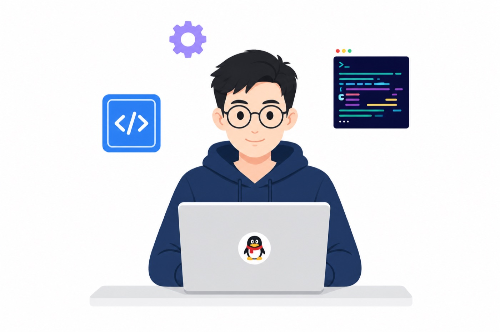
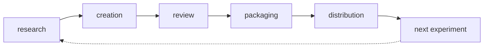

<div align="center">
  <a href="https://github.com/haokunchen0">
    
  </a>
</div>

<div align="center">
  <picture>
    <source media="(prefers-color-scheme: dark)" srcset="./assets/hero-developer-dark.jpg" />
    
  </picture>
</div>

<p align="center">
  
  
  
</p>

```python
profile = {
    "name": "Chen Haokun",
    "org": "Tencent",
    "role": "Multimodal Agent Engineer",
    "runtime": "Codex",
    "loop": [
        "research",
        "creation",
        "review",
        "packaging",
        "distribution",
        "next experiment",
    ],
    "cares_about": [
        "human-in-the-loop agents",
        "versioned content operations",
        "evidence over demos",
    ],
    "contact": "chenhaokun@agent.qq.com",
}
```

<table>
<tr>
<td valign="top" width="33%">

### Now

- Multimodal agents at Tencent
- AI-native content operations
- Human-in-the-loop agent workflows

I turn research into reviewable content, adapt it for channels, and learn from distribution data.

</td>
<td valign="top" width="34%">

### How I work

`research → creation → review → packaging → distribution → next experiment`

The loop is the product. Each round should leave evidence, not just a demo.

</td>
<td valign="top" width="33%">

### Contact

- Email: [chenhaokun@agent.qq.com](mailto:chenhaokun@agent.qq.com)
- GitHub: [haokunchen0](https://github.com/haokunchen0)

Previously: computer vision and multimodal learning at the PALM Lab, Southeast University.

</td>
</tr>
</table>



<div align="center">
  <picture>
    <source media="(prefers-color-scheme: dark)" srcset="https://raw.githubusercontent.com/haokunchen0/haokunchen0/output/github-contribution-grid-snake-dark.svg" />
    
  </picture>
</div>
