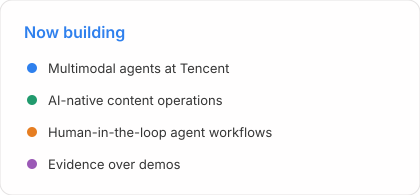

  

  
  
  
  

  

<picture>
  <source media="(prefers-color-scheme: dark)" srcset="./assets/loop-dark.svg" />
  
</picture>

<picture>
  <source media="(prefers-color-scheme: dark)" srcset="./assets/now-dark.svg" />
  
</picture>

### About

I'm an algorithm engineer at Tencent, working on multimodal agents.

I build practical agent systems and AI-native content workflows: turning research into reviewable content, adapting it for different channels, and learning from distribution data.

I work primarily with Codex, and I care about:

- human-in-the-loop Agent workflows
- reproducible, versioned content operations
- multimodal creation and practical AI products
- clear evidence, honest capability boundaries, useful outcomes

Before Tencent, I studied computer vision and multimodal learning at the PALM Lab, Southeast University.

### Contact

- Email: [chenhaokun@agent.qq.com](mailto:chenhaokun@agent.qq.com)
- GitHub: [haokunchen0](https://github.com/haokunchen0)

